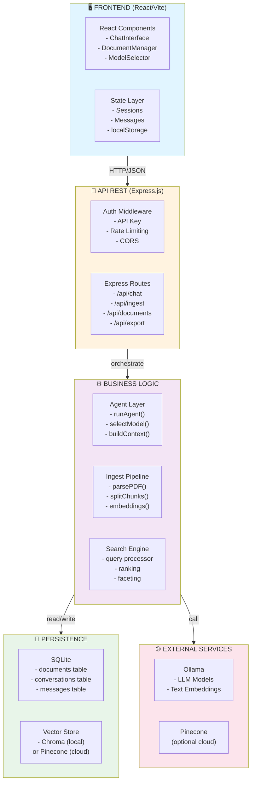
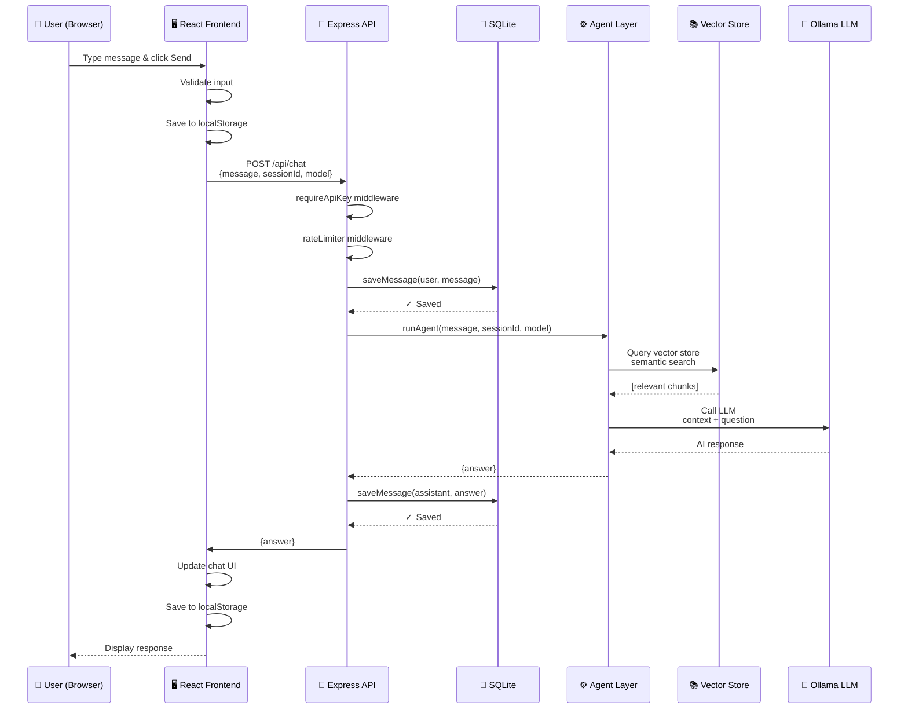

# 📚 Documentation Technique - Vue d'ensemble & Architecture

## 1. Résumé du Projet

### Objectif Principal
L'**Agentic Personal Assistant** est une application web intelligente qui combine:
- Un **agent IA conversationnel** (Ollama LLM)
- Un système de **gestion de documents** (PDF upload, chunking)
- Une **base vectorielle RAG** (Chroma ou Pinecone)
- Une **interface utilisateur réactive** (React + Vite)
- Une **base de données persistante** (SQLite)

### Cas d'Usage
1. **Chat avec IA** - Conversations multi-modèles avec Ollama
2. **Document Management** - Upload et gestion de PDFs
3. **RAG (Retrieval-Augmented Generation)** - Réponses basées sur documents
4. **Chat History** - Persistance des conversations
5. **Search & Export** - Recherche avancée et export multi-formats

### Stack Technique

#### Frontend
```
React 18 (UI framework)
├─ Vite (build tool)
├─ Tailwind CSS (styling)
├─ React Hooks (state management)
├─ localStorage (persistence)
└─ Vitest + Testing Library (testing)
```

#### Backend
```
Node.js 22 + Express.js
├─ SQLite (local database)
├─ Ollama (LLM inference)
├─ Chroma/Pinecone (vector database)
├─ LangChain (document processing)
└─ Vitest (testing)
```

#### DevOps
```
Docker + Docker Compose
├─ Ollama container
├─ Chroma container
├─ Node.js containers
└─ GitHub Actions (CI/CD)
```

---

## 2. Schéma d'Architecture Globale

### Diagramme Haute Niveau



---

## 3. Principes de Conception

### Architecture Globale: **Layered + Repository Pattern**

```
┌──────────────────────────────────────────────────┐
│  Presentation Layer (React Components)           │  ← UI
├──────────────────────────────────────────────────┤
│  API Layer (Express Routes + Middleware)         │  ← HTTP
├──────────────────────────────────────────────────┤
│  Business Logic Layer (Agent, Ingest, Search)   │  ← Core
├──────────────────────────────────────────────────┤
│  Persistence Layer (Repository pattern)          │  ← Database
│  ├─ documents.js (DocumentRepository)           │
│  ├─ chatHistory.js (ConversationRepository)     │
│  ├─ advancedSearch.js (SearchRepository)        │
│  ├─ export.js (ExportRepository)                │
│  └─ vectorstore.js (VectorStoreAdapter)         │
├──────────────────────────────────────────────────┤
│  Infrastructure Layer (Ollama, Pinecone)        │  ← External
└──────────────────────────────────────────────────┘
```

### Design Patterns

#### 1. **Repository Pattern** (Accès aux données)
```javascript
// documents.js
export function addDocument(id, metadata) { /* ... */ }
export function getDocument(id) { /* ... */ }
export function searchDocuments(query) { /* ... */ }
// Interface uniforme pour accéder aux documents
```

#### 2. **Adapter Pattern** (Intégrations externes)
```javascript
// vectorstore.js
if (usePinecone) {
  vectorStore = new Pinecone(config)
} else {
  vectorStore = new Chroma(config)
}
// Même interface pour différentes implémentations
```

#### 3. **Middleware Pattern** (Pipeline de traitement)
```javascript
app.use(cors(...))           // Cross-Origin
app.use(morgan(...))         // Logging
app.use(requireApiKey)       // Authentication
app.use(rateLimiter)         // Rate Limiting
app.use(errorHandler)        // Error Handling
```

#### 4. **Factory Pattern** (Création d'objets)
```javascript
// agent.js
function createLLM(modelName) {
  const config = getModelConfig(modelName)
  return new Ollama({ model: modelName, ...config })
}
```

#### 5. **Strategy Pattern** (Algorithmes alternatives)
```javascript
// Export strategies
const strategies = {
  json: (data) => JSON.stringify(data),
  csv: (data) => convertToCSV(data),
  text: (data) => formatAsText(data)
}
```

---

## 4. Flux de Données: Chat avec Document

### Scénario Complet



---

## 5. Intégrations Externes

### Ollama (Language Model)

| Aspect | Détail |
|--------|--------|
| **Purpose** | Local LLM inference |
| **Models** | qwen2:7b, mistral:7b, neural-chat:7b, nomic-embed-text |
| **API** | HTTP REST (localhost:11434) |
| **Fallback** | Error: "Ollama unavailable" |
| **Docker** | Container with port mapping 11434:11434 |

### Chroma (Vector Database - Local)

| Aspect | Détail |
|--------|--------|
| **Purpose** | Local semantic search |
| **Storage** | In-memory or persistent disk |
| **API** | HTTP (localhost:8000) |
| **Collections** | Dynamic per session |
| **Fallback** | Error: "ChromaDB connection failed" |

### Pinecone (Vector Database - Cloud)

| Aspect | Détail |
|--------|--------|
| **Purpose** | Scalable cloud vector search |
| **Auth** | API Key environment variable |
| **Region** | Configured per environment |
| **Namespace** | Per user/project isolation |
| **Fallback** | Fallback to Chroma local |

---

## 6. Sécurité

### Mesures Implémentées

```javascript
// 1. API Key Authentication
app.use((req, res, next) => {
  const apiKey = req.headers['x-api-key']
  if (!apiKey || apiKey !== process.env.API_KEY) {
    return res.status(401).json({ error: 'Unauthorized' })
  }
  next()
})

// 2. CORS Protection
app.use(cors({
  origin: (origin, callback) => {
    if (isDev && origin?.includes('localhost')) {
      callback(null, true)  // Allow all localhost in dev
    } else if (allowedOrigins.includes(origin)) {
      callback(null, true)  // Check whitelist in production
    } else {
      callback(new Error('CORS blocked'))
    }
  }
}))

// 3. Rate Limiting
const limiter = rateLimit({
  windowMs: 15 * 60 * 1000,  // 15 minutes
  max: 100,                   // 100 requests per window
  message: 'Too many requests'
})
app.use(limiter)

// 4. Input Validation
app.post('/api/chat', (req, res) => {
  const { message } = req.body
  if (!message || message.length > 4000) {
    return res.status(400).json({ error: 'Invalid message' })
  }
  // Process...
})

// 5. Error Sanitization
app.use((err, req, res, next) => {
  console.error(err)  // Log full error server-side
  res.status(500).json({  // Send generic error to client
    error: 'Internal server error'
  })
})
```

### Secrets Management

```bash
# .env (never commit!)
API_KEY=your-secret-key-here
PINECONE_API_KEY=pk-xxx
CORS_ORIGIN=http://localhost:5173,http://localhost:3001
```

---

## 7. Performance

### Optimisations

#### Database Indexes
```sql
CREATE INDEX idx_documents_uploadedAt ON documents(uploadedAt)
CREATE INDEX idx_conversations_sessionId ON conversations(sessionId)
CREATE INDEX idx_messages_conversationId ON messages(conversationId)
CREATE INDEX idx_messages_createdAt ON messages(createdAt)
```

#### Pagination
```javascript
// Search with pagination
app.post('/api/documents/search/advanced', (req, res) => {
  const { query, limit = 50, offset = 0 } = req.body
  // Use LIMIT/OFFSET for efficient pagination
  const results = advancedSearch({ query, limit, offset })
  res.json(results)
})
```

#### Caching Strategy
```javascript
// localStorage caching (frontend)
const sessions = JSON.parse(localStorage.getItem('sessions') || '{}')

// Rate limiting (backend)
// Prevents excessive database queries
```

### Cibles de Performance

| Métrique | Cible | Statut |
|----------|-------|--------|
| Chat Response | < 3s | ✓ (LLM dependent) |
| Search Query | < 500ms | ✓ |
| PDF Upload | < 5s | ✓ (10MB limit) |
| Page Load | < 1s | ✓ |
| Test Suite | < 2s | ✓ (45 tests) |

---

## 8. Monitoring & Health Checks

### Endpoint de Santé

```
GET /healthz

Response:
{
  "status": "ok",
  "timestamp": "2025-02-15T10:30:00Z",
  "checks": {
    "database": "connected",
    "ollama": "available",
    "vectorstore": "healthy"
  }
}
```

### Logging

```javascript
// Morgan HTTP logger
app.use(morgan(':method :url :status :response-time ms'))

// Custom application logging
console.log('[INFO]', 'Document saved:', documentId)
console.error('[ERROR]', 'Ollama connection failed:', error)
```

---

## 9. Dépendances Critiques

### Backend

```json
{
  "express": "REST API framework",
  "better-sqlite3": "Local database driver",
  "langchain": "Document processing & RAG",
  "@langchain/community": "Integration with Ollama/Chroma",
  "cors": "Cross-Origin Resource Sharing",
  "express-rate-limit": "Rate limiting",
  "dotenv": "Environment variables",
  "uuid": "ID generation"
}
```

### Frontend

```json
{
  "react": "UI framework",
  "vite": "Build tool & dev server",
  "tailwindcss": "Utility CSS",
  "vitest": "Unit testing"
}
```

### DevOps

```yaml
Docker:
  - Node.js:22
  - Ollama (proprietary image)
  - Chroma (chroma-ai/chroma)

GitHub Actions:
  - Linting: ESLint
  - Tests: Vitest
  - E2E: Playwright
```

---

## 10. Déploiement

### Environnements

#### Développement
```bash
$ npm run dev:full
- Frontend: http://localhost:5173
- Backend: http://localhost:3001
- Ollama: localhost:11434
- Chroma: localhost:8000
```

#### Production
```bash
$ docker-compose -f docker-compose.yml up
- Frontend: served by Vite (or nginx)
- Backend: Express on port 3001
- SQLite: /data/app.db
- Vector Store: Pinecone (cloud)
```

---

**Document Version**: 1.0  
**Dernière mise à jour**: Février 2025  
**Auteur**: Agentic Personal Assistant Team
