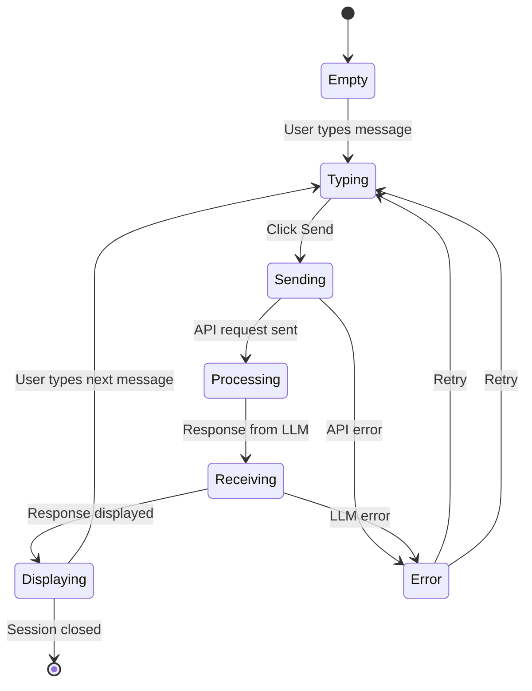

# 📂 Documentation Technique - Structure du Code & Modules

## 1. Arborescence Complète du Projet

```
agentic-personal-assistant/
│
├── 📁 server/ ........................... Backend (Node.js + Express)
│   ├── index.js ........................ Entry point + API routes (550 lignes)
│   ├── agent.js ........................ LLM orchestration & RAG
│   ├── db.js ........................... SQLite database initialization
│   ├── documents.js ................... Document repository (CRUD)
│   ├── chatHistory.js ................. Conversation persistence
│   ├── advancedSearch.js .............. Search engine (7 functions)
│   ├── export.js ....................... Export system (11 functions)
│   ├── ingest.js ....................... PDF processing pipeline
│   ├── vectorstore.js ................. Vector DB abstraction
│   ├── tools.js ........................ Utility functions
│   │
│   ├── 📁 data/ ........................ Database files
│   │   ├── app.db ..................... SQLite database
│   │   ├── app.db-shm ................ Write-Ahead Log (WAL)
│   │   └── app.db-wal ................ WAL log file
│   │
│   ├── 📁 tests/ ....................... Unit tests
│   │   ├── server.test.js ............ API endpoint tests (9 tests)
│   │   └── features.test.js ......... Feature tests (9 tests)
│   │
│   ├── package.json ................... Dependencies + scripts
│   ├── vitest.config.js ............... Test configuration
│   ├── nodemon.json ................... Dev server watcher
│   ├── Dockerfile ..................... Container build
│   └── eslint.config.js ............... Linting rules
│
├── 📁 client/ .......................... Frontend (React + Vite)
│   ├── 📁 src/
│   │   ├── App.jsx .................... Main component + routing
│   │   ├── 📁 components/
│   │   │   ├── ChatInterface.jsx ...... Chat UI
│   │   │   ├── DocumentManager.jsx ... Document management
│   │   │   ├── ModelSelector.jsx ..... Model dropdown
│   │   │   └── SessionManager.jsx ... Session management
│   │   │
│   │   ├── 📁 __tests__/ .............. Unit tests
│   │   │   ├── App.test.jsx ......... App logic tests (18 tests)
│   │   │   ├── DocumentManager.test.jsx (27 tests)
│   │   │   └── setup.js ............ Test environment setup
│   │   │
│   │   ├── 📁 hooks/ ................. React custom hooks
│   │   ├── 📁 utils/ ................. Utility functions
│   │   └── index.css ................. Global styles
│   │
│   ├── 📁 public/ ..................... Static assets
│   ├── 📁 e2e/ ........................ E2E tests (Playwright)
│   ├── index.html ..................... HTML entry point
│   ├── package.json ................... Dependencies
│   ├── vite.config.js ................ Build configuration
│   ├── vitest.config.js .............. Test configuration
│   ├── playwright.config.ts ......... E2E test config
│   └── eslint.config.js .............. Linting
│
├── 📁 .github/
│   ├── 📁 workflows/
│   │   └── ci.yml .................... GitHub Actions CI/CD
│
├── 📁 DOCS/ ........................... Technical documentation
│   ├── 01-OVERVIEW.md ................ Architecture globale
│   ├── 02-CODE_STRUCTURE.md ......... Structure du code (ce fichier)
│   ├── 03-DIAGRAMS.md ............... Diagrammes Mermaid
│   ├── 04-API_SPEC.md ............... API documentation
│   ├── 05-SETUP_GUIDE.md ............ Setup & deployment
│   └── 06-DATABASE_SCHEMA.md ........ Schéma BD
│
├── 🐳 docker-compose.yml ............. Production containers
├── 🐳 docker-compose.dev.yml ........ Development containers
├── 🐳 docker-compose.ci.yml ......... CI/CD containers
│
├── 📚 *.md ............................ Markdown documentation (33 files)
│   ├── README.md ..................... Project overview
│   ├── QUICK_WINS_IMPLEMENTATION_SUMMARY.md
│   ├── FEATURE_ROADMAP.md ........... 20-feature roadmap
│   ├── DOCUMENTATION_INDEX.md ....... Docs index
│   └── ... (29 more docs)
│
├── 🔧 package.json ................... Root package (npm workspaces)
├── 📜 .gitignore ..................... Git ignore rules
└── 📄 LICENSE ........................ MIT License
```

---

## 2. Cartographie Détaillée des Modules

### Backend Modules

#### **server/index.js** (550+ lignes)
**Responsabilité**: Orchestration API + Routes

```javascript
// Middleware stack
cors() → morgan() → express.json() → requireApiKey() → rateLimiter()

// Route groups
GET  /healthz ...................... Health check
GET  /api/config ................... Configuration
GET  /api/models ................... List Ollama models

// Chat routes
POST /api/chat ..................... Send message
GET  /api/conversations/:sessionId . Get history
POST /api/conversations/search ..... Search conversations

// Document routes
POST /api/ingest ................... Upload PDF
GET  /api/documents ................ List documents
POST /api/documents/search/advanced  Advanced search
GET  /api/documents/search/facets .. Get facets
GET  /api/documents/search/suggestions Autocomplete

// Export routes
GET  /api/export/documents/json ... Export JSON
GET  /api/export/documents/csv ... Export CSV
GET  /api/export/database/full ... Full backup

// Error handler
(err, req, res, next) .............. Centralized error handling
```

#### **server/agent.js**
**Responsabilité**: LLM Orchestration + RAG

```javascript
export async function runAgent({ message, sessionId, model }) {
  // 1. Select LLM model
  const llm = await listOllamaModels()
  
  // 2. Query vector store
  const relevantChunks = await vectorStore.query(message, k=5)
  
  // 3. Build context prompt
  const context = buildPrompt(relevantChunks, message)
  
  // 4. Call LLM
  const response = await ollama.generate({
    model: model,
    prompt: context
  })
  
  // 5. Return response
  return { answer: response.text, model }
}
```

**Key Functions**:
- `runAgent()` - Main chat orchestration
- `listOllamaModels()` - Query available models
- `buildPrompt()` - Construct context from chunks
- `LLMUnavailableError` - Custom error class

#### **server/db.js**
**Responsabilité**: Database Initialization & Connection

```javascript
// Database setup
import Database from 'better-sqlite3'
const db = new Database(dbPath)
db.pragma('journal_mode = WAL')  // Write-Ahead Logging

// Schema initialization
function initializeSchema() {
  db.exec(`CREATE TABLE IF NOT EXISTS documents (...)`)
  db.exec(`CREATE TABLE IF NOT EXISTS conversations (...)`)
  db.exec(`CREATE TABLE IF NOT EXISTS messages (...)`)
  // Create indexes
}

export default db
```

**Tables**:
| Table | Fields | Indexes |
|-------|--------|---------|
| documents | id, fileName, fileSize, pageCount, uploadedAt | uploadedAt |
| conversations | id, sessionId, createdAt, updatedAt | sessionId |
| messages | id, conversationId, role, content, model, createdAt | conversationId, createdAt |

#### **server/documents.js**
**Responsabilité**: Document Repository (CRUD Operations)

```javascript
// CRUD
export function addDocument(id, metadata) { /* INSERT */ }
export function getDocument(id) { /* SELECT */ }
export function listDocuments() { /* SELECT * */ }
export function deleteDocument(id) { /* DELETE */ }

// Search
export function searchDocuments(query) { /* LIKE search */ }
export function getDocumentStats() { /* Aggregation */ }

// Persistence
export function clearDocuments() { /* Clean for testing */ }
```

**Before**: In-memory Map (lost on restart)  
**After**: SQLite with persistent storage ✓

#### **server/chatHistory.js**
**Responsabilité**: Conversation Persistence

```javascript
export function saveMessage(sessionId, role, content, model) {
  // Get or create conversation
  let conversation = getConversationBySessionId(sessionId)
  if (!conversation) {
    conversation = createConversation(sessionId)
  }
  // Save message to database
  insertMessage(conversation.id, role, content, model)
}

export function getConversation(sessionId) {
  // Return all messages for session
  return queryMessages(sessionId)
}
```

**Key Functions**:
- `saveMessage()` - Save user/AI messages
- `getConversation()` - Retrieve full chat history
- `getAllConversations()` - List all conversations
- `deleteConversation()` - Remove conversation
- `getConversationStats()` - Count aggregates

#### **server/advancedSearch.js**
**Responsabilité**: Search Engine avec Filters

```javascript
// 7 search functions
export function advancedSearch(options) { /* Full-text + pagination */ }
export function searchByDateRange(options) { /* Date filtering */ }
export function searchByFileSizeRange(options) { /* Size filtering */ }
export function getSearchFacets() { /* Grouped counts */ }
export function getSearchSuggestions(prefix) { /* Autocomplete */ }
export function exportSearchResults(options) { /* Export matches */ }
export function getSimilarDocuments(docId, type) { /* Similarity */ }
```

**Facets Returned**:
```javascript
{
  dates: [{date: "2025-02-15", count: 3}],
  sizes: [{sizeRange: "1-5MB", count: 8}],
  pages: [{pageRange: "10-19 pages", count: 6}]
}
```

#### **server/export.js**
**Responsabilité**: Multi-Format Export Engine

```javascript
// Documents export
export function exportDocumentsAsJSON(docs) { /* {...} */ }
export function exportDocumentsAsCSV(docs) { /* "id,name,..." */ }
export function exportDocumentsAsText(docs) { /* "Document Report\n..." */ }

// Conversations export
export function exportConversationsAsJSON(convs) { /* {...} */ }
export function exportConversationAsText(sessionId, msgs) { /* Transcript */ }

// Database export
export function exportFullDatabaseAsJSON() { /* Backup */ }

// Utilities
export function generateExportFileName(type, format) { /* timestamp */ }
```

**Formats Supported**: JSON, CSV, Plain Text

#### **server/ingest.js**
**Responsabilité**: PDF Processing Pipeline

```javascript
export async function ingestData(filePath, metadata) {
  // 1. Load PDF
  const pdf = await PDFLoader.load(filePath)
  
  // 2. Split into chunks
  const chunks = await splitter.splitDocuments(pdf)
  
  // 3. Filter metadata (only serializable fields)
  const cleanMetadata = filterMetadata(metadata)
  
  // 4. Store in vector DB
  await vectorStore.addDocuments(chunks, cleanMetadata)
  
  // 5. Return summary
  return { chunksCount, pageCount, documentId }
}
```

**Pipeline Steps**:
1. PDF Loading via LangChain PDFLoader
2. Text Splitting (recursive character splitter)
3. Metadata Filtering (no non-serializable objects)
4. Vector Storage (Chroma or Pinecone)
5. Document Registration (SQLite)

#### **server/vectorstore.js**
**Responsabilité**: Vector Database Abstraction (Adapter Pattern)

```javascript
export function getVectorStoreConfig() {
  if (process.env.USE_PINECONE === 'true') {
    return new Pinecone({
      apiKey: process.env.PINECONE_API_KEY,
      environment: process.env.PINECONE_ENVIRONMENT
    })
  } else {
    return new Chroma({
      url: 'http://localhost:8000'
    })
  }
}
```

**Supports**:
- Chroma (local, in-memory)
- Pinecone (cloud, scalable)

---

### Frontend Modules

#### **client/src/App.jsx** (Main Component)

```jsx
export default function App() {
  // State
  const [sessions, setSessions] = useState(loadSessionsFromStorage())
  const [currentSession, setCurrentSession] = useState(null)
  const [messages, setMessages] = useState([])
  const [selectedModel, setSelectedModel] = useState('qwen2:7b')
  
  // Handlers
  const handleSendMessage = async (message) => { /* POST /api/chat */ }
  const handleUploadDocument = async (file) => { /* POST /api/ingest */ }
  const handleClearConversation = () => { /* Delete session */ }
  
  // Render
  return (
    <div className="app">
      <ModelSelector models={models} onSelect={setSelectedModel} />
      <ChatInterface messages={messages} onSend={handleSendMessage} />
      <DocumentManager documents={documents} />
    </div>
  )
}
```

**Responsibilities**:
- Session management
- Message orchestration
- File uploads
- State persistence (localStorage)

#### **client/src/components/**

| Component | Responsabilité |
|-----------|-----------------|
| ChatInterface.jsx | Chat message display + input |
| DocumentManager.jsx | PDF upload + file listing |
| ModelSelector.jsx | LLM model dropdown |
| SessionManager.jsx | Session CRUD |

---

## 3. Flux de Données (Data Flow)

### From Input to Persistence

```
┌─────────────────────────────────────────────────────────────┐
│  1. USER INPUT                                              │
│     └─ React component captures text/file                   │
└─────────────────────────────────────────────────────────────┘
                            ↓
┌─────────────────────────────────────────────────────────────┐
│  2. FRONTEND VALIDATION                                     │
│     └─ Check length, file type, required fields             │
└─────────────────────────────────────────────────────────────┘
                            ↓
┌─────────────────────────────────────────────────────────────┐
│  3. API CALL                                                │
│     └─ POST /api/chat | /api/ingest | /api/export          │
│        + headers (X-API-Key, Content-Type)                  │
└─────────────────────────────────────────────────────────────┘
                            ↓
┌─────────────────────────────────────────────────────────────┐
│  4. MIDDLEWARE PIPELINE (server/index.js)                  │
│     ├─ CORS check                                           │
│     ├─ API Key validation (requireApiKey)                   │
│     ├─ Rate limiting check                                  │
│     └─ Body parsing (express.json)                          │
└─────────────────────────────────────────────────────────────┘
                            ↓
┌─────────────────────────────────────────────────────────────┐
│  5. ROUTE HANDLER (server/index.js)                        │
│     └─ Extract parameters from req.body                     │
└─────────────────────────────────────────────────────────────┘
                            ↓
┌─────────────────────────────────────────────────────────────┐
│  6. BUSINESS LOGIC                                          │
│  For Chat:                                                  │
│     ├─ chatHistory.saveMessage() [DB write]                │
│     ├─ agent.runAgent() [LLM + Vector search]              │
│     └─ chatHistory.saveMessage() [DB write response]       │
│                                                             │
│  For Upload:                                                │
│     ├─ ingest.ingestData() [PDF → Vector store]            │
│     └─ documents.addDocument() [DB register]               │
│                                                             │
│  For Export:                                                │
│     └─ export.exportAs{JSON|CSV|Text}() [Format]           │
└─────────────────────────────────────────────────────────────┘
                            ↓
┌─────────────────────────────────────────────────────────────┐
│  7. DATABASE OPERATIONS                                     │
│     ├─ SQLite (documents, conversations, messages)         │
│     └─ Vector Store (Chroma or Pinecone)                   │
└─────────────────────────────────────────────────────────────┘
                            ↓
┌─────────────────────────────────────────────────────────────┐
│  8. EXTERNAL CALLS (if needed)                             │
│     ├─ Ollama LLM (for chat)                               │
│     └─ Pinecone (if cloud vector DB)                       │
└─────────────────────────────────────────────────────────────┘
                            ↓
┌─────────────────────────────────────────────────────────────┐
│  9. RESPONSE CONSTRUCTION                                   │
│     └─ Format as JSON (or file download for exports)        │
└─────────────────────────────────────────────────────────────┘
                            ↓
┌─────────────────────────────────────────────────────────────┐
│  10. ERROR HANDLING                                         │
│      └─ Centralized error handler (server/index.js)        │
│         └─ Log full error server-side                      │
│         └─ Send generic message to client                  │
└─────────────────────────────────────────────────────────────┘
                            ↓
┌─────────────────────────────────────────────────────────────┐
│  11. FRONTEND DISPLAY                                       │
│      ├─ Update React state                                 │
│      ├─ Re-render components                               │
│      └─ Save to localStorage                               │
└─────────────────────────────────────────────────────────────┘
```

---

## 4. Gestion des États

### State Management Architecture

#### Frontend (React)
```javascript
// Component-level state
const [messages, setMessages] = useState([])
const [selectedModel, setSelectedModel] = useState('qwen2:7b')
const [documents, setDocuments] = useState([])

// localStorage persistence
useEffect(() => {
  localStorage.setItem('sessions', JSON.stringify(sessions))
}, [sessions])

// Custom hook
function useSessions() {
  const [sessions, setSessions] = useState(() => {
    return JSON.parse(localStorage.getItem('sessions') || '{}')
  })
  return { sessions, setSessions }
}
```

#### Backend (Database)
```javascript
// SQLite tables act as source of truth
// Queries are read directly from DB
// No in-memory cache (except connection pool)

// Example: Get conversation
const conversation = db.prepare(`
  SELECT * FROM messages 
  WHERE conversationId = ? 
  ORDER BY createdAt ASC
`).all(convId)
```

### State Transitions



---

## 5. Dépendances entre Modules

### Dependency Graph

```
index.js (API orchestrator)
├── agent.js (LLM calls)
│   ├── vectorstore.js (semantic search)
│   │   ├── Pinecone SDK
│   │   └── Chroma SDK
│   └── Ollama HTTP client
├── documents.js (CRUD operations)
│   └── db.js (SQLite connection)
├── chatHistory.js (Conversation persistence)
│   └── db.js (SQLite connection)
├── ingest.js (PDF processing)
│   ├── PDFLoader (LangChain)
│   ├── vectorstore.js
│   └── documents.js (register document)
├── advancedSearch.js (Search logic)
│   └── db.js (SQLite queries)
└── export.js (Export engine)
    ├── documents.js (fetch data)
    └── chatHistory.js (fetch data)
```

---

**Document Version**: 1.0  
**Dernière mise à jour**: Février 2025
