# 📊 Documentation Technique - Diagrammes Mermaid

## 1. Diagramme d'Architecture Haute Niveau (C4 Model)

### System Context
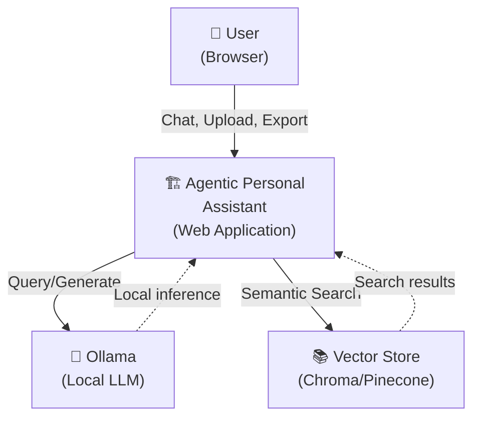

### Container Diagram
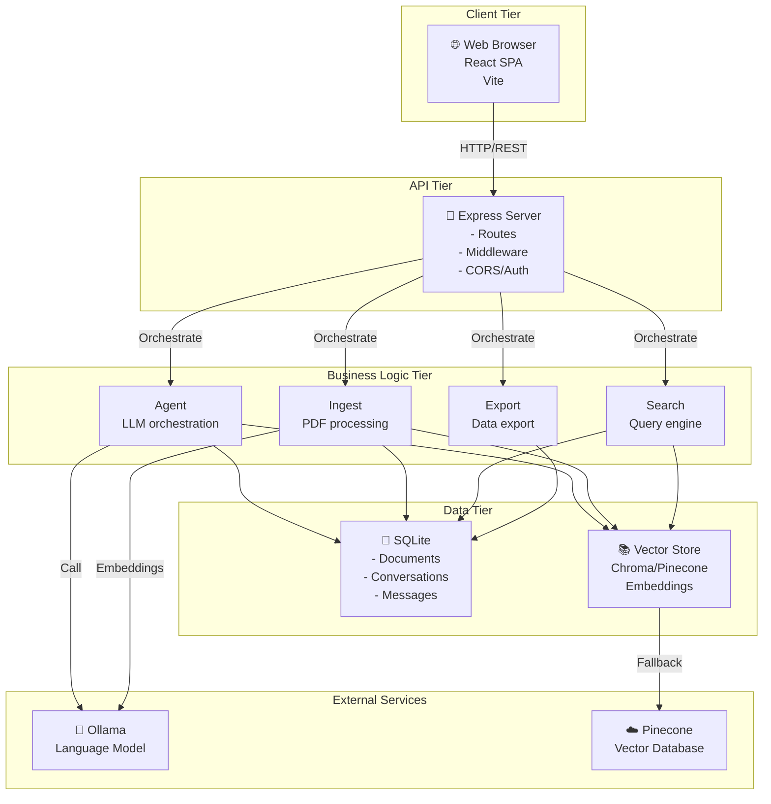

---

## 2. Diagrammes de Séquence

### Scénario 1: Chat avec Contexte de Document

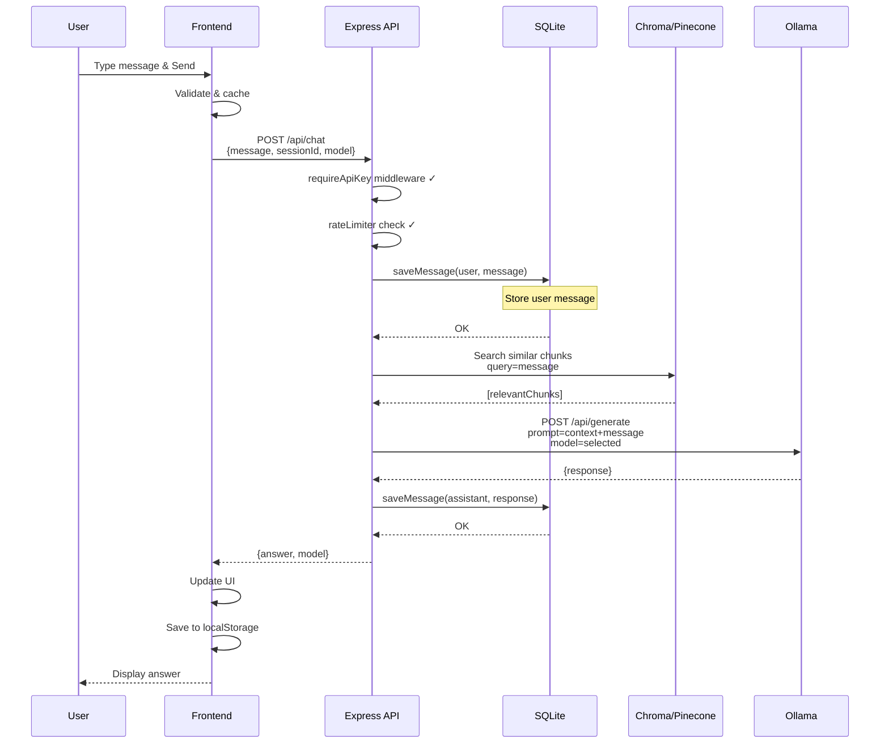

### Scénario 2: Upload & Ingestion de Document PDF

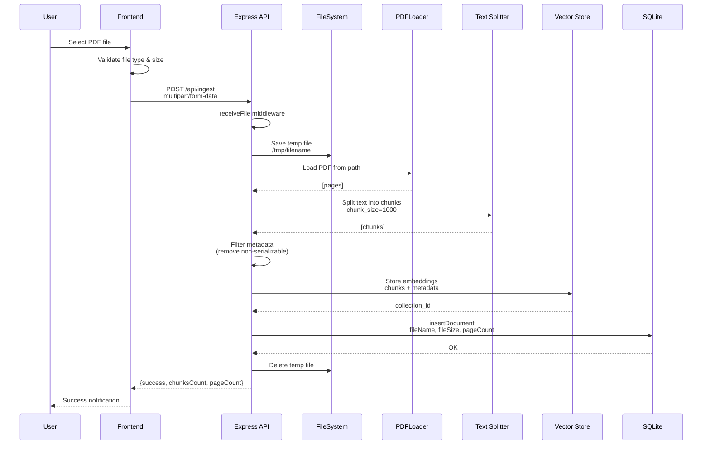

### Scénario 3: Export Multi-Format

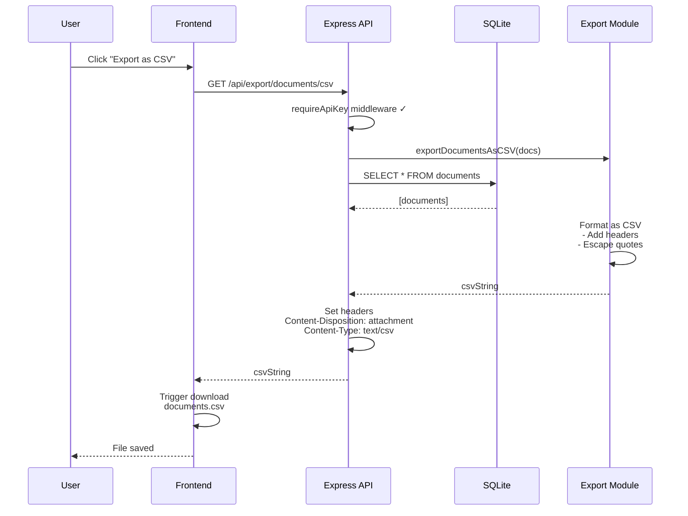

### Scénario 4: Recherche Avancée avec Facettes

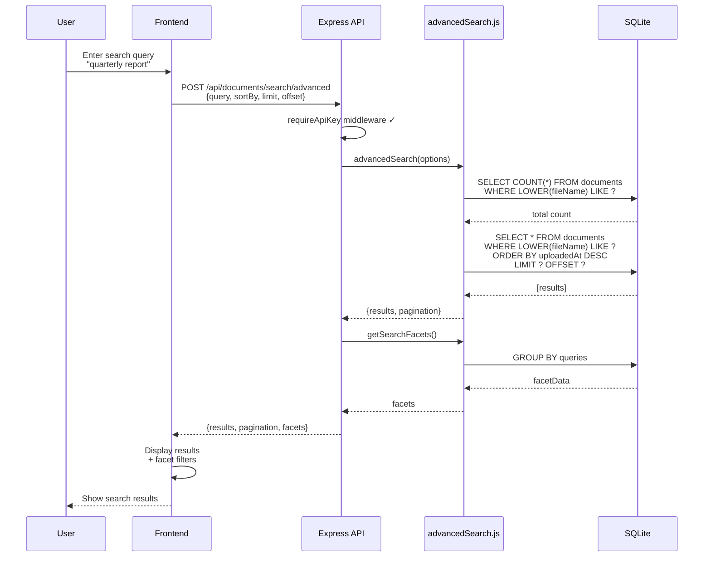

---

## 3. Diagramme de Classe / Entités

### Modèle Objet (Frontend)

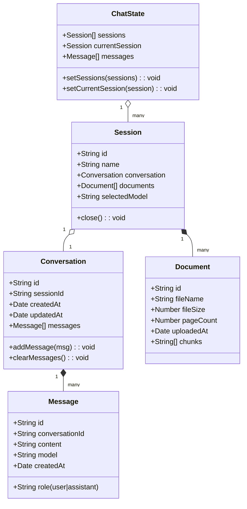

### Modèle Données (Backend)

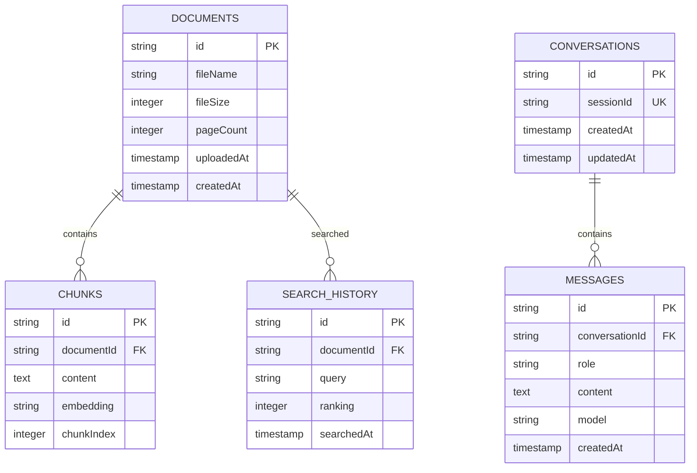

---

## 4. Diagramme Entity-Relationship (ERD) Détaillé

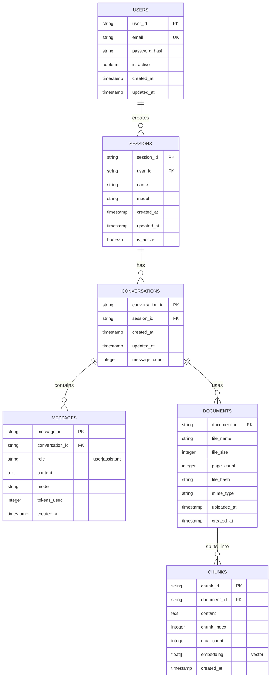

---

## 5. Diagrammes d'État

### Message State Machine

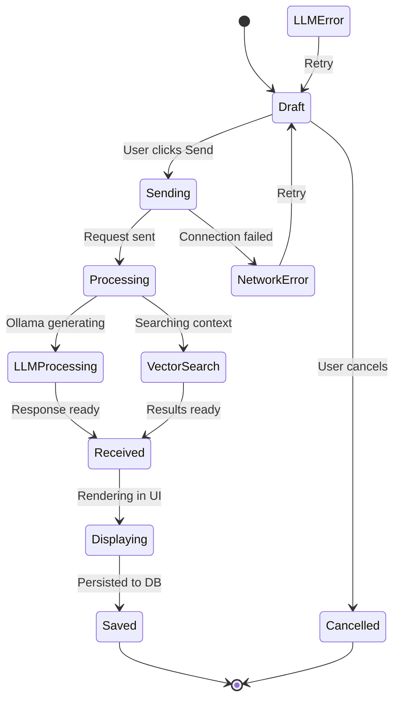

### Document Upload State Machine

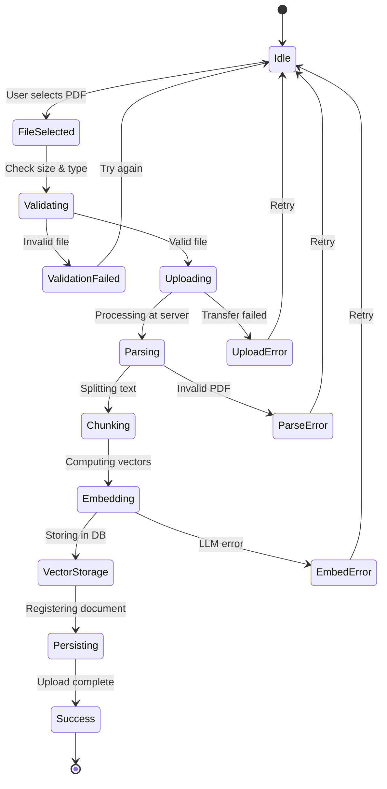

### Search Query State Machine

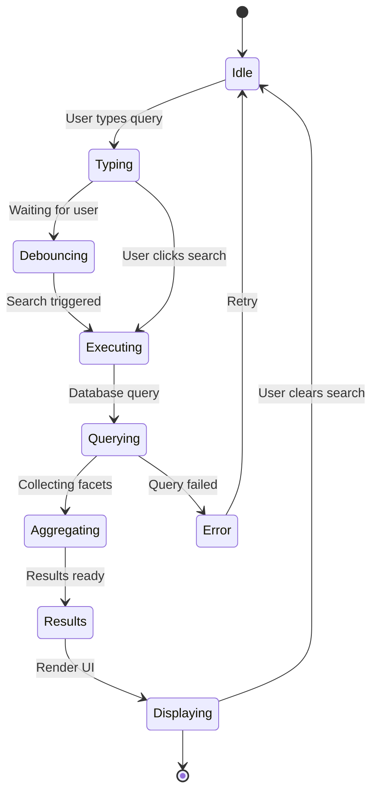

### Export Process State Machine

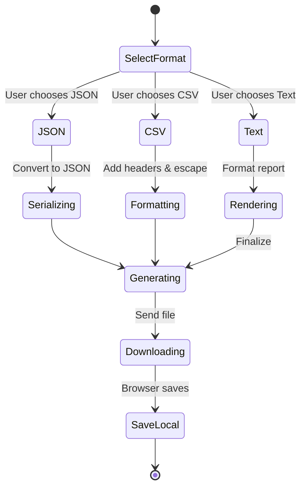

---

## 6. Diagramme de Flux API

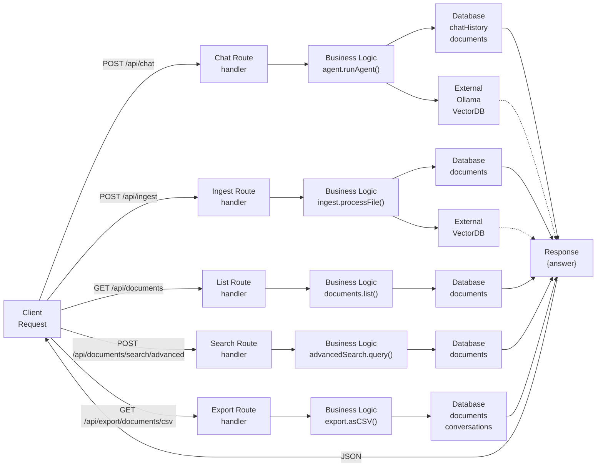

---

## 7. Diagramme de Composants Frontend

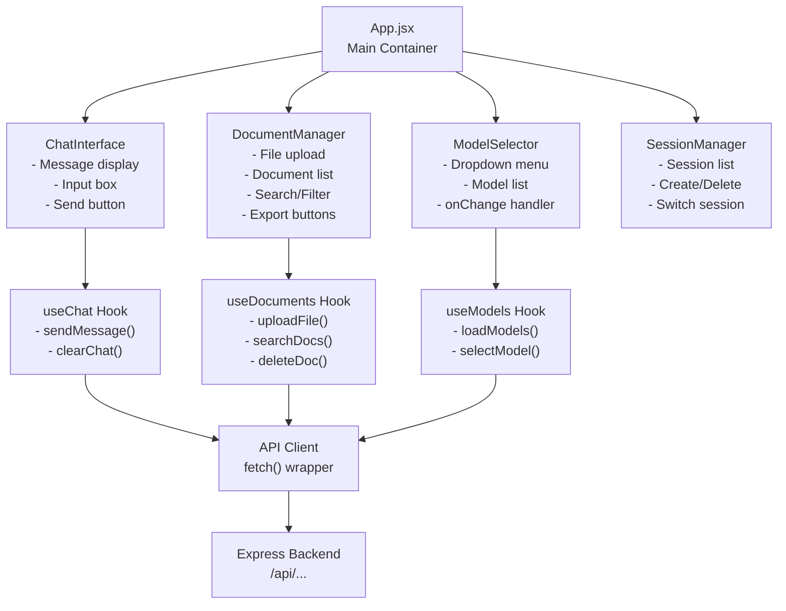

---

**Document Version**: 1.0  
**Dernière mise à jour**: Février 2025
